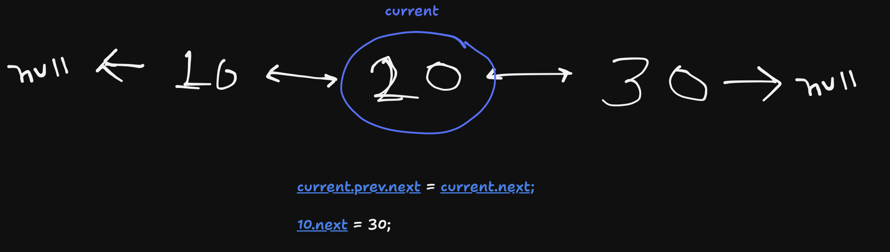

# LinkedList docs

## singly linked list 

- it only have `value` and `next` , so we can only traverse in one direction

```
head -> 10 -> 20 -> 30 -> null
```

## doubly linked list 

- its nodes have `value` , `next` and `prev` , so traversing both ways is easy

```
null ← 10 ⇄ 20 ⇄ 30 → null
```

#### Deleting a middle item in doubly linked list
